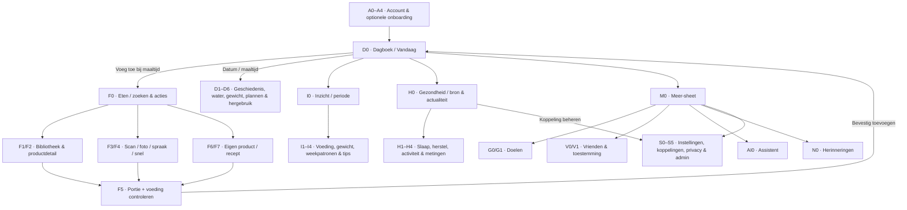

# BiteWise — mobiele navigatie en screen flow

**Status:** product-/UX-specificatie voor een **nieuw** BiteWise-project; geen implementatie of werkende app. **Versie:** 1.0. **Companion:** `DESIGN.md` en `SPARK_GOAL.md` in dezelfde greenfield-map. De hierna genoemde schermen en routes zijn het voorgestelde contract voor Spark, geen claims over bestaande schermen. Interface standaard Nederlands; Engelse labels in de referenties zijn geen voorgestelde UI-tekst.

## 1. Wat de referenties ons leren — en wat we niet overnemen

| Product/richtlijn | Waarneembaar patroon | BiteWise-besluit |
|---|---|---|
| MyFitnessPal | Het dagboek is het startscherm (`Today`); maaltijdrijen openen direct het loggen; calorieën, macro's en maaltijden staan bovenaan. Hetzelfde product heeft ook een globale plus-actie.[1] | Dagboek als startpunt en maaltijdgebonden **Voeg toe**; géén tweede globale plus naast dezelfde actie. |
| MacroFactor | Scan, zoeken, snel toevoegen en bibliotheek zijn tijdens het loggen onderling bereikbaar; recente/favoriete producten staan vooraan.[2] | Eén Eten-hub en één gedeelde `Portie controleren`-stap voor alle invoermethoden. Geen aparte scan-/AI-uitkomst die zonder controle opslaat. |
| Cronometer | Eén dagboek combineert dagelijkse totalen, maaltijdregels, datumwissel en contextuele bewerking.[3] | Eén duidelijke dagstaat; bewerk-/verplaatsacties op de maaltijd of regel, niet gekopieerd op een tweede dashboard. |
| WHOOP | Veelgebruikte gezondheidsinhoud in een bottom bar; overige opties in `More`.[4] | Gezondheid is top-level, optionele koppelingen en beheer blijven dieper; geen aparte wearable-home. |
| Apple | Tab bars navigeren tussen top-level secties; Liquid Glass hoort bij de **functionele navigatielaag**, niet als decoratieve laag op alle content; de heldere variant is alleen geschikt onder gecontroleerde omstandigheden.[5][6] | Alleen de dock en hoogstens een functionele sheet krijgen een glasbehandeling; gegevenskaarten blijven vlak, leesbaar en rustig. Een PWA imiteert de uitstraling, niet de native systeemeffecten. |
| Material Design | Een mobiele navigatiebalk is bedoeld voor 3–5 vaste bestemmingen; de bestemmingen wisselen niet per scherm.[7] | Vijf stabiele ingangen; contextual acties en secundaire modules worden geen extra tabs. |

**Synthese:** `Dagboek → Eten → Inzicht → Gezondheid → Meer` is geordend van dagelijkse actie, via registratie, naar reflectie en configuratie. Tabnamen zijn kort en begrijpelijk voor beginnende én fanatieke (kracht-/conditie-)sporters. Gebruik geen tweede hamburger, tweede homepage of zwevende plus met dezelfde bestemming.

## 2. De vijf vaste bestemmingen

| Tab (icoonconcept) | Kernvraag | Root-screen en eerste viewport | Buiten de tab |
|---|---|---|---|
| **Dagboek** (kalender/dag) | Wat staat er vandaag op mijn bord? | Datum, resterende kcal als één focuspunt, doel en progress, drie macro's, dunne waterprogress, maaltijdgroepen met eigen actie. | Zoekcatalogus, trends, ruwe gezondheidsdetails en instellingen. |
| **Eten** (vork/zoek) | Hoe registreer of beheer ik eten? | Zoekveld en compacte keuze `Zoek · Scan · Foto · Snel`; daaronder Recent/Favorieten/Opgeslagen maaltijden/Recepten en één toegang tot `Mijn producten`. Geen tweede kcal-samenvatting. | Dagboekoverzicht, gezondheidskaartjes en dubbele globale plus. |
| **Inzicht** (trend) | Wat veranderde er werkelijk? | Periodekeuze, 1–2 duidelijke conclusies, doelvoortgang, compacte trends voeding/gewicht; verder in details. | Dagelijkse invoer, live sync en connectorformulieren. |
| **Gezondheid** (hart/puls) | Wat zeggen mijn optionele gezondheidsgegevens? | Slaap/Herstel/Activiteit alleen waar betrouwbaar, actuele bron + tijd, één verklaarbare conclusie, relevante metingen met details. Zonder koppeling: rustige lege staat met link `Koppeling instellen`. | Kalorietotalen nog eens uittekenen, providerinstellingen en medische claims. |
| **Meer** (drie punten) | Waar staan mijn doelen en beheer? | Toegankelijke **sheet**, geen extra dashboard: Doelen, Vrienden, AI-assistent, Herinneringen, Instellingen & privacy; beheer via laatste route. | Herhaling van primaire tabs, tweede notificatie-inbox of voedselcatalogus. |

**Globaal:** top rechts op relevante root-schermen één meldingen-icoon voor de **inbox** (niet de instellingen voor herinneringen). Dagboek toont datum-navigatie en een contextuele `Voeg toe` per maaltijd; Eten is óók bereikbaar via de vaste tab. De logo-/profielplek mag niet impliciet een tweede verborgen menu worden. Na aanmelding landt de gebruiker op Dagboek. Bij eerste gebruik is er eerst onboarding.

### Eigenaarschap, om duplicatie te voorkomen

| Gegevens/actie | Enige primaire plek | Toegestane contextuele doorgang |
|---|---|---|
| Calorie-, macro- en watertotalen van vandaag | Dagboek | Inzicht gebruikt deze gegevens alleen voor vergelijkingen over een periode; Eten toont ze niet opnieuw. |
| Eten toevoegen en eigen producten/recepten | Eten + gedeeld `Portie controleren` | Dagboek-maaltijdknop opent deze flow **met maaltijd en datum vooraf gekozen**. |
| Water toevoegen | Dagboek → regel `Water` | Overige routes linken naar die regel, geen tweede waterknop in de samenvatting. |
| Gewicht toevoegen | Dagboek → `Gewicht` in dagdetails | Inzicht → gewichtstrend opent hetzelfde invoerscherm met datumcontext. |
| Doelen bewerken | Meer → Doelen | Tik op dagdoel brengt naar bijbehorend Doelen-detail; nooit inline én apart tegelijk bewerken. |
| Health-meting, bron, verversing | Gezondheid | Meer → Instellingen → Koppelingen beheert toestemming en accountkoppeling, maar toont geen tweede health-dashboard. |
| Meldingen lezen | Inbox (top rechts) | Meer → Herinneringen beheert *voorkeuren*, niet een tweede inbox. |
| AI-assistent | Meer → AI-assistent | Contextuele tip kan dezelfde chat openen met zichtbare context, nooit verborgen invoer of automatische doelwijziging. |

## 3. Screen map met vaste IDs

**Toegang/onboarding:** `A0` Welkom → `A1` Aanmelden / Account maken / Wachtwoord herstellen → `A2` Taal + eenheden → `A3` Startprofiel en voorstel kcal/macro's (altijd aanpasbaar) → `A4` Optionele toestemming voor gezondheid/notificaties (`Overslaan` duidelijk) → `D0` Dagboek. Een terugkerende gebruiker gaat `A1 → D0`; een nog niet afgeronde onboarding hervat bij de juiste stap. Gezondheidskoppeling is geen toegangseis.

**Dagboek:** `D0` Vandaag/datum → `D1` Dag- en maaltijdgeschiedenis + zoekbare dagnotities; `D0 → D2` Maaltijddetail (bewerk/verplaats/kopieer/bewaar/maak leeg met bevestiging); `D2 → F0` Eten met dag+maaltijd; `D0 → D3` Waterregel (volume kiezen, doel tonen, bewerken); `D0 → D4` Gewicht/dagnotitie (eigen geschiedenis, geen andere lichaamsmaten); `D0 → D5` Geplande maaltijden (plannen, later expliciet **Gegeten registreren**). `D0 → D6` Gisteren/vast gebruik: voorstel → selecteren → bevestigen, nooit stille logging.

**Eten:** `F0` Hub/search/ingangen → `F1` Producten zoeken/bibliotheek (Recent, Favoriet, Opgeslagen, Recepten; Filter-sheet categorie/allergenen/herkomst) → `F2` Productdetail (foto, merk, barcode, waarden, portiebron, ontbrekende waarden) → `F5` Portie controleren; `F0 → F3` Scanner (gevonden → `F2`; onbekend → `F4` Foto etiket of handmatige waarden → `F5`); `F0 → F4` Snelle handmatige invoer/spraak/foto met **conceptstatus** en expliciete controle → `F5`; `F0 → F6` Eigen product maken/bewerken; `F0 → F7` Eigen maaltijd/recepteditor (ingrediënten ordenen, voeding herberekenen, bewaren) → `F5`; `F5 → D0/D2` `Toevoegen aan [maaltijd]` met succesbevestiging. Wanneer F0 rechtstreeks via tab wordt geopend, kiest F5 één keer de dag+maaltijd; via D2 is deze al voorgeselecteerd maar wijzigbaar. Een ongeldige of onbekende portie laat alleen geldige gram/ml-opties toe.

**Inzicht:** `I0` Overzicht + periode → `I1` Calorieën/macro's/voedingsstoffen → `I2` Gewicht/water/doelvoortgang → `I3` Weekpatronen/vergelijk vorige periode → `I4` Tipdetails: gebruikte gegevens, onzekerheid, verbergen. De gekozen periode blijft bij terugnavigeren. Een ontbrekende voedingswaarde telt niet als nul; onvoldoende data geeft een expliciete lege conclusie.

**Gezondheid:** `H0` Overzicht → `H1` Slaapdetail, `H2` Hersteldetail, `H3` Activiteitsdetail, `H4` Meting/historie. Vanuit `H0` → `S2` Koppelingen bij ontbrekende, verlopen of mislukte sync. In `H0`: duidelijke bron + tijd laatste geslaagde sync, foutstatus en `Nu synchroniseren` (indien zinvol); geen fictieve score zonder betrouwbare gegevens. Koppelingen voor Apple Health, beschikbare nieuwe Google Health-route, Android Health Connect, en Strava als afzonderlijke optie. Geen Garmin/Withings.

**Meer:** `M0` Meer-sheet → `G0` Doelen (energie/macro, water/gewicht, relevante beschikbare gezondheidsdoelen) → `G1` Doel bewerken/voorstel controleren; `M0 → V0` Vrienden (zoeken/verzoeken) → `V1` Verzoek/zichtbaarheidsrechten (gewicht, dagboek, doelen, gezondheid standaard privé); `M0 → AI0` Assistent (provider+model via `S3`, context/eigen gegevens pas na toestemming); `M0 → N0` Herinneringen (eten, drinken, wegen, slapen + weekoverzicht); `M0 → S0` Instellingen & privacy → `S1` Profiel, taal, eenheden, thema → `S2` Koppelingen → `S3` AI-provider/model → `S4` Privacy, export, verwijderen van gegevens/account. Admin ziet bij eigen rol `S5` Accounts & diagnostiek; gewone gebruikers zien dit **nooit**. Inbox `N1` is te openen via het icon in de topbar van relevante root-schermen, met detail en dismiss.

## 4. Visueel hoofdpad (Mermaid; werkt in viewers met Mermaid-ondersteuning)

**Diagramconventie:** de pijlen tussen D0 en andere roots staan voor de **vaste bottom nav**, niet voor op elkaar gestapelde dashboardkaarten. In de daadwerkelijk gerenderde UI blijft de dock zichtbaar tijdens root-schermen en detailpagina's, behalve camera en immersieve invoer waar hij tijdelijk wijkt voor de eigen duidelijke terugknop.

## 5. Gedrag van de liquid-glass bottom nav

- **Dock:** vijf gelijkwaardige icon+tekst-items; vaste volgorde `Dagboek | Eten | Inzicht | Gezondheid | Meer`. Geen horizontaal scrollende items, geen dynamisch herschikken. Actieve sectie met ingetogen groen en subtiele lichtlaag; iconen ook zonder kleur herkenbaar. Tekstlabels blijven zichtbaar, ook bij niet-geselecteerde tabs. Geen bounce-/geluidseffecten.
- **Materiaal:** donker diepgroen getint semitransparant dockvlak, gecontroleerde blur alleen achter de dock, fijne rand en subtiele highlight; actieve chip met lichte diepte. Licht thema behoudt dezelfde hiërarchie met getint lichtvlak en donkergroene leesbare labels. Alle contentkaarten zijn **geen glas**. Normale PWA-CSS (`backdrop-filter`) is een visuele benadering; browser of Android hoeft geen Apple-native Liquid Glass te leveren. Voor native wrappers uitsluitend bewezen native API's gebruiken; nooit beweren dat CSS systeemeffecten activeert.[5]
- **Veiligheid/leesbaarheid:** onderliggende grafiek/beelden mogen doorschijnen, maar navtekst en iconen blijven leesbaar (ook boven drukke content); ondoorzichtige fallback bij ontbrekende blur, hoog contrast, verhoogde transparantie-instellingen of `prefers-reduced-transparency`. Minimum hit area **44×44 CSS px** voor iedere tab en sheetrij, zichtbare toetsenbordfocus en correcte `aria-current="page"` op actieve route; spreek alle labels uit.
- **Plaatsing:** dock onderaan binnen de echte zichtbare viewport en doorlopend in `env(safe-area-inset-bottom)`; reserveer scrollruimte voor inhoud + safe area **precies één keer**. Geen overlap met invoervelden, iPhone-home-indicator, toetsenbord of onderste lijstitem. Minimaliseer of verberg de dock niet enkel omdat content scrollt; houd positie stabiel bij toetsopening, browserhervatting en PWA-koude start. Native tab bar mag door het systeem anders renderen; informatiearchitectuur blijft identiek.
- **Terugnavigatie:** tik op een andere root-tab → diens laatste scroll-/filterstaat terug, tenzij context expliciet opnieuw `Vandaag` vereist; tik op dezelfde tab → terug naar root en scroll naar boven (herhaalbaar). Android Back/Browser Back sluit eerst sheet/dialog, daarna detailroute, pas dan de app; iOS heeft zichtbare terugknop op detail. `Meer` opent sheet; Escape/Back/sluiten brengt vorige tab terug, openen van een Meer-detail houdt Meer als actieve sectie. Deep links landen rechtstreeks in juiste root+detail zonder login/consent te omzeilen.
- **Wat niet in de dock hoort:** account, instellingen, providerkoppelingen, barcode als eigen tab, AI-assistent als tab, notificatie-inbox, doelen als zesde tab, en een herhaalde centrale plus. Camera/voice vragen toestemming pas bij gebruik; afwijzing biedt tekstinvoer. Foto/spraakresultaat is een concept tot de gebruiker bevestigt.

## 6. Zes volledig voorgeschreven gebruikspaden

1. **Nieuwe gebruiker zonder wearable:** `A0 → A1 → A2 → A3 → A4 (Overslaan) → D0 → D2[Ontbijt: Voeg toe] → F0[Recent/zoek] → F2 → F5[portie/gram + kcal/macro's direct herberekend] → Bevestigen → D0`. Geen lege Gezondheid-dwingelandij of automatische targetaanpassing.
2. **Barcode onbekend:** `D2[Voeg toe] → F0 → F3[scan] → F4[foto etiket of handmatig] → F5[waarde/portie/herkomst controleren] → zelf bewaren (optioneel) → Bevestigen → D0`. Bij geen camera: handmatige route. Missende macro staat als `—`, niet `0`.
3. **Gisteren opnieuw eten:** `D0 → D6 → kies producten/maaltijd → controleer dag+maaltijd+portie → expliciet Bevestigen → D0`; bij annuleren verandert niets. Dagelijkse vaste consumptie is een suggestie, geen auto-log.
4. **Trend naar actie:** `D0 → Inzicht I0 → I3[weekpatroon] → I4[bron, volledigheid en redenering] → D0 of F0[één relevante vervolgstap]`; geen onverklaarde score of doelwijziging.
5. **Health-koppeling:** `H0[geen data] → S2[kies ondersteunde bron + scope] → toestemming → H0[laatst succesvol / nu sync] → H1–H4`; bij fout/stale blijven eerder bekende metingen gedateerd, maar de score van vandaag niet automatisch opgepoetst. De gebruiker kan de connector ook via `Meer → Instellingen → Koppelingen` vinden; dat is dezelfde route, geen tweede configuratiescherm.
6. **Vrienden/privacy:** `Meer → V0[zoek] → verzoek → V1[toon exact welke gegevens zichtbaar worden, alles privé als standaard] → toestaan/weigeren → terug`; geen vriendenkaart met gewicht/healthdata zonder expliciete toestemming.

## 7. Screen-state- en ontwerptest

Voor **elke root**: gevuld, leeg, laden, gedeeltelijk, fout en offline; voor Gezondheid extra verouderd/geen toestemming/sync-fout; voor F5 extra product zonder bekende portie, onvolledige voedingswaarde en AI-schatting. Laat nav, datum- en detailstructuur stabiel waar de inhoud ontbreekt. Toon fout/herstelacties in de betreffende sectie, niet als globaal vals succes.

**Schermsets voor visuele review:** iPhone-PWA 390 / 402 / 430 CSS px, compacte Android (360–412 px), tablet en desktop. Zowel licht/donker als vergrote tekst, lange vertaalde labels en toetsenbord open. Test echte verticale scroll tot onderste actie, geen horizontale overflow; tappunten, back/forward, focus-terugkeer, no-duplication (er is precies één kcal-hero, één invoerpad, één syncbeheer) en onderscheid tussen Apple-PWA-nabootsing en echt native gedrag.

**Ontwerpbesluit / uitvoering:** Spark gebruikt dit bestand samen met `DESIGN.md` en `SPARK_GOAL.md`, en maakt eerst klikbare mobiele schermprototypes voordat hij de app bouwt. Deze flow specificeert de informatiearchitectuur; hij bewijst geen werkende scan, AI, wearable-koppeling of pushmelding.

## Sources

[1] https://support.myfitnesspal.com/hc/en-us/articles/39985611667341-Your-Today-tab — MyFitnessPal Today tab
[2] https://help.macrofactorapp.com/en/articles/215-how-to-log-food-in-macrofactor — MacroFactor food logging
[3] https://support.cronometer.com/hc/en-us/articles/360018593112-Mobile-Diary-Overview — Cronometer mobile diary
[4] https://www.whoop.com/us/en/thelocker/app-update-navigation-bar — WHOOP navigation bar
[5] https://developer.apple.com/design/human-interface-guidelines/materials — Apple Materials Liquid Glass
[6] https://developer.apple.com/design/human-interface-guidelines/tab-bars — Apple Tab bars
[7] https://m3.material.io/components/navigation-bar/overview — Material Design navigation bar
